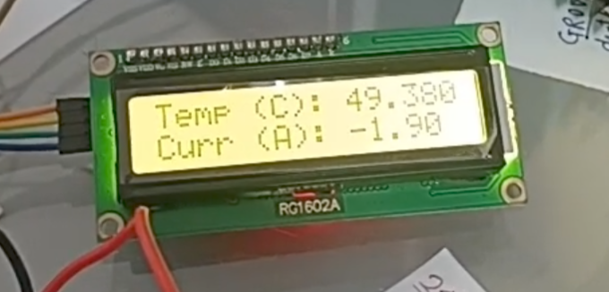

# temperature_currentCunsuption_meter
 Arduino Temperature and Current Monitoring System
 # Arduino Temperature and Current Monitoring System

 <!-- Add an image of your project here, if available -->

**Project Description:**

The Arduino Temperature and Current Monitoring System is a versatile electronics project that combines the functionalities of temperature sensing and current measurement into a single device. This project is designed to provide real-time data on temperature and electrical current consumption, making it ideal for various applications such as environmental monitoring, energy management, and industrial automation.

## Table of Contents

- [Hardware Requirements](#hardware-requirements)
- [Software Requirements](#software-requirements)
- [Installation](#installation)
- [Usage](#usage)
- [Contributing](#contributing)
- [License](#license)

## Hardware Requirements

To replicate this project, you'll need the following hardware components:

1. Arduino Uno or Compatible Board
2. DS18B20 Temperature Sensor
3. ACS712 Current Sensor
4. 16x2 I2C LCD Display
5. Jumper Wires
6. Power Supply
7. Breadboard (Optional)
8. Resistors (Optional)
9. Enclosure (Optional)
10. USB Cable
11. Computer

Ensure that you have all these components before starting the project.

## Software Requirements

To program the Arduino and work with this project, you'll need the following software:

1. Arduino IDE: Download and install the Arduino Integrated Development Environment (IDE) from [Arduino's official website](https://www.arduino.cc/en/software).

2. Required Libraries: Install the necessary libraries for the DS18B20 temperature sensor, ACS712 current sensor, and I2C LCD display. You can install libraries using the Arduino Library Manager.

## Installation

1. Clone or download this GitHub repository to your local machine.

   ```bash
   git clone https://github.com/yourusername/arduino-temperature-current-monitoring.git
